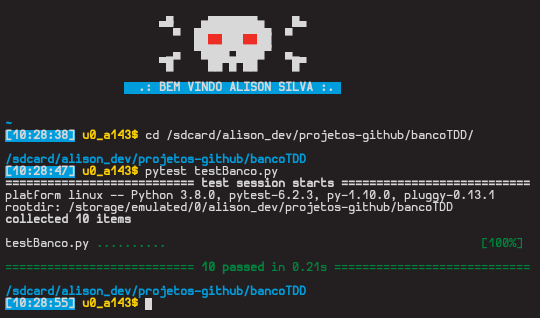

# test drive development

simples programa pratico com foco em desenvolvimento TDD com python usando a biblioteca PYTEST.
## instalação
Para instalar a biblioteca para rodar o programa execute:  
> pip install -r requirements.txt

Depois rode o teste
> pytest testBanco.py

Se sua saida for igual a esta o teste rodou com sucesso sem nenhum erro ; ).
